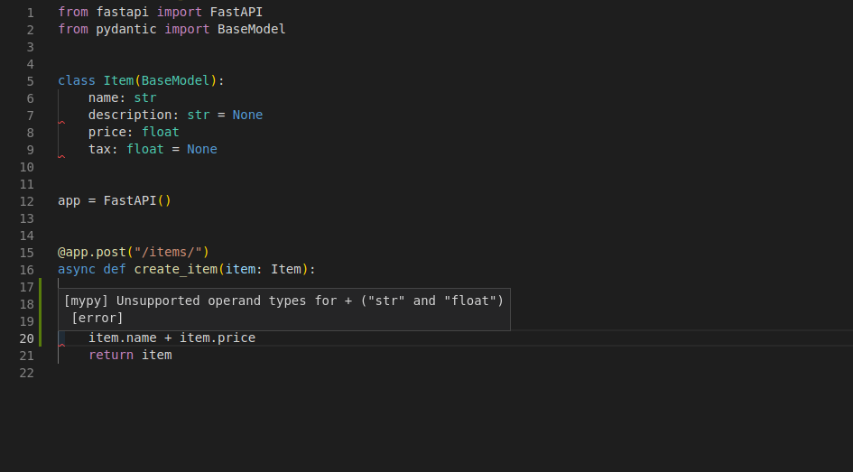

## 2.1. Request Body

When you need to send data from a client (let's say, a browser) to your API, 
you send it as a request body.
A **request body** is data sent by the client to your API. 

A **response body** is the data your API sends to the client.

Your API almost always has to send a response body. 
But clients don't necessarily need to send request bodies all the time, 
sometimes they only request a path, maybe with some query parameters, 
but don't send a body.

To declare a request body, 
you use Pydantic models with all their power and benefits.

**Info**: 

To send data, you should use one of: 
`POST` (the more common), `PUT`, `DELETE` or `PATCH`.
    
Sending a body with a `GET` request has an 
undefined behavior in the specifications, 
nevertheless, it is supported by FastAPI, 
only for very complex/extreme use cases.

As it is discouraged, 
the interactive docs with Swagger UI won't show 
the documentation for the body when using GET, 
and proxies in the middle might not support it.

------------------------------------------------------------------------------------------

### Basics

#### Create your data model

First, you need to import `BaseModel` from `pydantic`:

Then you declare your data model as a class that inherits from `BaseModel`.

Use standard Python types for all the attributes:

```Python 3.10+
from pydantic import BaseModel

class Item(BaseModel):
    name: str
    description: str | None = None
    price: float
    tax: float | None = None
```

The same as when declaring query parameters, 
when a model attribute has a default value, it is not required. 
Otherwise, it is required. Use `None` to make it just optional.

For example, this model above declares a JSON "object" (or Python `dict`) like:

```
{
    "name": "Foo",
    "description": "An optional description",
    "price": 45.2,
    "tax": 3.5
}
```

as `description` and `tax` are optional (with a default value of `None`), 
this JSON "object" would also be valid:

```
{
    "name": "Foo",
    "price": 45.2
}
```


#### Declare it as a parameter

To add it to your path operation, declare it the same way you declared path and query parameters:

```Python 3.10+
from fastapi import FastAPI
from pydantic import BaseModel

class Item(BaseModel):
    name: str
    description: str | None = None
    price: float
    tax: float | None = None

app = FastAPI()

@app.post("/items/")
async def create_item(item: Item):
    return item
```

and declare its type as the model you created, Item.


#### Results

With just that Python type declaration, FastAPI will:

- Read the body of the request as JSON.
- Convert the corresponding types (if needed).
- Validate the data.
  * If the data is invalid, it will return a nice and clear error, 
  indicating exactly where and what was the incorrect data.
- Give you the received data in the parameter item.
  * As you declared it in the function to be of type Item, 
  you will also have all the editor support (completion, etc) 
  for all of the attributes and their types.
- Generate [JSON Schema](https://json-schema.org/) definitions for your model, 
  you can also use them anywhere else you like 
  if it makes sense for your project.
- Those schemas will be part of the generated OpenAPI schema, 
  and used by the automatic documentation UIs.


#### Automatic docs

The JSON Schemas of your models will be part of your OpenAPI generated schema, and will be shown in the interactive API docs:

<div style="text-align: center;">
    
</div> 


And will also be used in the API docs inside each path operation that needs them:

<div style="text-align: center;">
    
</div> 


#### Editor support

In your editor, inside your function you will get type hints and completion everywhere 
(this wouldn't happen if you received a `dict` instead of a Pydantic model):

<div style="text-align: center;">
    
</div> 

You also get error checks for incorrect type operations:

<div style="text-align: center;">
    
</div> 

This is not by chance, the whole framework was built around that design.

And it was thoroughly tested at the design phase, before any implementation, to ensure it would work with all the editors.

There were even some changes to Pydantic itself to support this.

The previous screenshots were taken with Visual Studio Code.

But you would get the same editor support with PyCharm and most of the other Python editors.


#### Use the model

Inside of the function, you can access all the attributes of the model object directly:

```Python 3.10+
from fastapi import FastAPI
from pydantic import BaseModel

class Item(BaseModel):
    name: str
    description: str | None = None
    price: float
    tax: float | None = None

app = FastAPI()

@app.post("/items/")
async def create_item(item: Item):
    item_dict = item.dict()
    if item.tax:
        price_with_tax = item.price + item.tax
        item_dict.update({"price_with_tax": price_with_tax})
    return item_dict
```


#### Request body + path parameters

You can declare path parameters and request body at the same time.

FastAPI will recognize that the function parameters that 
match path parameters should be taken from the path, 
and that function parameters that are declared to be Pydantic models should be taken from the request body.


```Python 3.10+
from fastapi import FastAPI
from pydantic import BaseModel

class Item(BaseModel):
    name: str
    description: str | None = None
    price: float
    tax: float | None = None

app = FastAPI()

@app.put("/items/{item_id}")
async def update_item(item_id: int, item: Item):
    return {"item_id": item_id, **item.dict()}
```


#### Request body + path + query parameters

You can also declare body, path and query parameters, all at the same time.

FastAPI will recognize each of them and take the data from the correct place.

```Python 3.10+
from fastapi import FastAPI
from pydantic import BaseModel

class Item(BaseModel):
    name: str
    description: str | None = None
    price: float
    tax: float | None = None

app = FastAPI()

@app.put("/items/{item_id}")
async def update_item(
    item_id: int, item: Item, q: str | None = None
):
    result = {"item_id": item_id, **item.dict()}
    if q:
        result.update({"q": q})
    return result
```

The function parameters will be recognized as follows:

  - If the parameter is also declared in the path, 
    it will be used as a path parameter.
  - If the parameter is of a singular type 
    (like `int`, `float`, `str`, `bool`, etc) 
    it will be interpreted as a query parameter.
  - If the parameter is declared to be of the type of a Pydantic model, 
    it will be interpreted as a request body.


#### Without Pydantic

If you don't want to use Pydantic models, 
you can also use Body parameters. 

See the docs for Body - [Multiple Parameters: Singular values in body](https://fastapi.tiangolo.com/tutorial/body-multiple-params/#singular-values-in-body).

------------------------------------------------------------------------------------------

### Body - Multiple Parameters


#### Mix `Path`, `Query` and body parameters

First, of course, you can mix `Path`, `Query` and request body parameter declarations freely and FastAPI will know what to do.

And you can also declare body parameters as optional, by setting the default to `None`:

```Python 3.10+
from typing import Annotated
from fastapi import FastAPI, Path
from pydantic import BaseModel

app = FastAPI()

class Item(BaseModel):
    name: str
    description: str | None = None
    price: float
    tax: float | None = None

@app.put("/items/{item_id}")
async def update_item(
    item_id: Annotated[int, Path(title="The ID of the item to get", ge=0, le=1000)],
    q: str | None = None,
    item: Item | None = None,
):
    results = {"item_id": item_id}
    if q:
        results.update({"q": q})
    if item:
        results.update({"item": item})
    return results
```

Notice that, in this case, 
the `item` that would be taken from the body is optional. 
As it has a `None` default value.


#### Multiple body parameters

In the previous example, the path operations would expect a JSON body with the attributes of an `Item`, like:

```python
{
    "name": "Foo",
    "description": "The pretender",
    "price": 42.0,
    "tax": 3.2
}
```

But you can also declare multiple body parameters, e.g. `item` and `user`:

```Python 3.10+
from fastapi import FastAPI
from pydantic import BaseModel

app = FastAPI()

class Item(BaseModel):
    name: str
    description: str | None = None
    price: float
    tax: float | None = None

class User(BaseModel):
    username: str
    full_name: str | None = None

@app.put("/items/{item_id}")
async def update_item(item_id: int, item: Item, user: User):
    results = {"item_id": item_id, "item": item, "user": user}
    return results
```

In this case, FastAPI will notice that 
there is more than one body parameter in the function 
(there are two parameters that are Pydantic models).

So, it will then use the parameter names as keys 
(field names) in the body, and expect a body like:

```python
{
    "item": {
        "name": "Foo",
        "description": "The pretender",
        "price": 42.0,
        "tax": 3.2
    },
    "user": {
        "username": "dave",
        "full_name": "Dave Grohl"
    }
}
```

Notice that even though the `item` was declared the same way as before, 
it is now expected to be inside of the body with a key `item`.

FastAPI will do the automatic conversion from the request, 
so that the parameter `item` receives its specific content and the same for user.

It will perform the validation of the compound data, 
and will document it like that for the OpenAPI schema and automatic docs.


#### Singular values in body

The same way there is a `Query` and `Path` 
to define extra data for query and path parameters, 
FastAPI provides an equivalent `Body`.

For example, extending the previous model, 
you could decide that you want to have another key importance in the same body, 
besides the `item` and `user`.

If you declare it as is, because it is a singular value, 
FastAPI will assume that it is a query parameter.

But you can instruct FastAPI to treat it as another body key using `Body`:

```Python 3.10+
from typing import Annotated
from fastapi import Body, FastAPI
from pydantic import BaseModel

app = FastAPI()

class Item(BaseModel):
    name: str
    description: str | None = None
    price: float
    tax: float | None = None

class User(BaseModel):
    username: str
    full_name: str | None = None

@app.put("/items/{item_id}")
async def update_item(
    item_id: int, item: Item, user: User, importance: Annotated[int, Body()]
):
    results = {"item_id": item_id, "item": item, "user": user, "importance": importance}
    return results
```

In this case, FastAPI will expect a body like:

```python
{
    "item": {
        "name": "Foo",
        "description": "The pretender",
        "price": 42.0,
        "tax": 3.2
    },
    "user": {
        "username": "dave",
        "full_name": "Dave Grohl"
    },
    "importance": 5
}
```

Again, it will convert the data types, validate, document, etc.


#### Multiple body params and query

Of course, you can also declare 
additional query parameters whenever you need, 
additional to any body parameters.

As, by default, singular values are interpreted as query parameters, 
you don't have to explicitly add a `Query`, you can just do:

```python
q: str | None = None
```

For example:

```Python 3.10+
from typing import Annotated
from fastapi import Body, FastAPI
from pydantic import BaseModel

app = FastAPI()

class Item(BaseModel):
    name: str
    description: str | None = None
    price: float
    tax: float | None = None

class User(BaseModel):
    username: str
    full_name: str | None = None

@app.put("/items/{item_id}")
async def update_item(
    *,
    item_id: int,
    item: Item,
    user: User,
    importance: Annotated[int, Body(gt=0)],
    q: str | None = None,
):
    results = {"item_id": item_id, "item": item, "user": user, "importance": importance}
    if q:
        results.update({"q": q})
    return results
```

Body also has all the same extra validation and metadata parameters as `Query`, `Path` and others you will see later.


#### Embed a single body parameter

Let's say you only have a single `item` body parameter from a Pydantic model `Item`.

By default, FastAPI will then expect its body directly.

But if you want it to expect a JSON with a key `item` and inside of it the model contents, 
as it does when you declare extra body parameters, 
you can use the special `Body` parameter `embed`:

```python
item: Item = Body(embed=True)
```

as in:

```Python 3.10+
from typing import Annotated
from fastapi import Body, FastAPI
from pydantic import BaseModel

app = FastAPI()

class Item(BaseModel):
    name: str
    description: str | None = None
    price: float
    tax: float | None = None

@app.put("/items/{item_id}")
async def update_item(item_id: int, item: Annotated[Item, Body(embed=True)]):
    results = {"item_id": item_id, "item": item}
    return results
```

In this case FastAPI will expect a body like:

```python
{
    "item": {
        "name": "Foo",
        "description": "The pretender",
        "price": 42.0,
        "tax": 3.2
    }
}
```

instead of:

```python
{
    "name": "Foo",
    "description": "The pretender",
    "price": 42.0,
    "tax": 3.2
}
```


#### Recap

You can add multiple body parameters to your *path operation function*, 
even though a request can only have a single body.

But FastAPI will handle it, 
give you the correct data in your function, 
and validate and document the correct schema in the path operation.

You can also declare singular values to be received as part of the body.

And you can instruct FastAPI to embed the body in a key 
even when there is only a single parameter declared.


### Reference Materials

  - [FastAPI > Learn > Tutorial - User Guide > Request Body](https://fastapi.tiangolo.com/tutorial/body/)

  - [FastAPI > Learn > Tutorial - User Guide > Body - Multiple Parameters](https://fastapi.tiangolo.com/tutorial/body-multiple-params)

